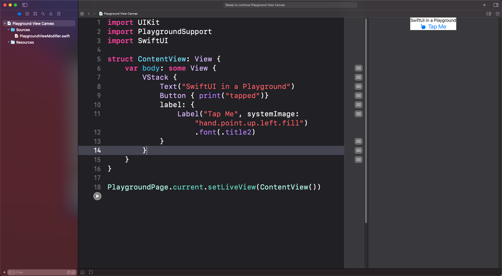
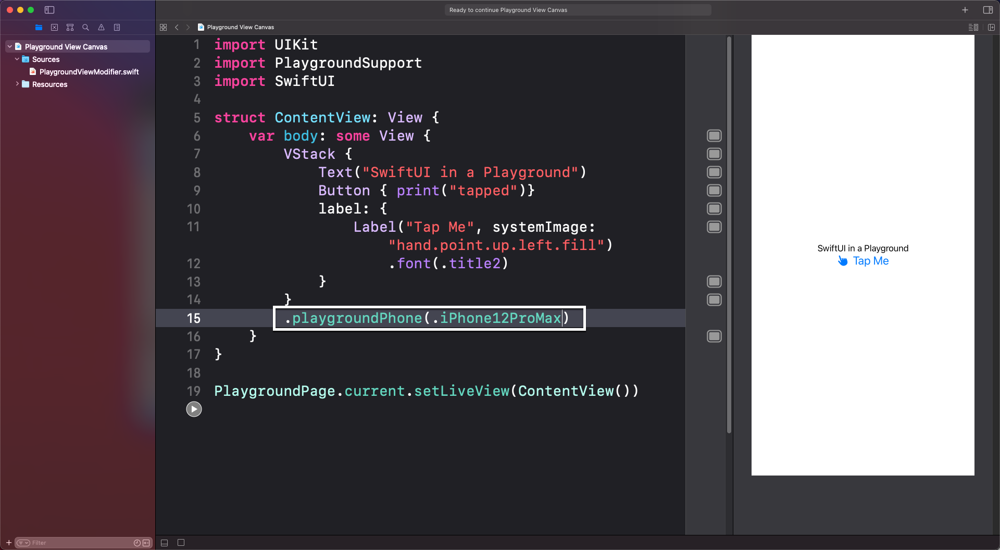

# PlaygroundViewModifier


You can import PlaygroundSupport and SwiftUI to your Xcode playgrounds and then create a SwiftUIView like this
#### Step 1. Import PlayGroundSupport and SwiftUI

`````swift
import UIKit
import PlaygroundSupport
import SwiftUI


struct ContentView: View {
  var body: some View {
      VStack {
          Text("SwiftUI in a Playground")
          Button(action: {print("tapped")}, label: {
              Label("Tap Me", systemImage: "hand.point.up.left.fill")
                  .font(.title2)
          })
      }
  }
}
`````

#### Step 2. Set the current playground page live view to the ContentView()

> **Note:** in an earlier version of this, I used a UIHostingViewController.  This is not necessary,  You can now just use setLiveView()

If you want to see the view presented, you need to add the following code after your ContentView struct

`````swift
PlaygroundPage.current.setLiveView(ContentView())
`````

Now when you run your playground, you will see the content view displayed to the right.



The problem is that the frame does not represent any particular iPhone as you see on the canvas when you are running a full XCode project.

##### Option 1

You could embed your view (in this case the VStack) inside a NavigationView and optionally provide a title.

`````swift
NavigationView {
    // The previous body content
    }
    .navigationTitle("Test")
}
`````

The problem is that you don't know what the size is and you cannot compare how your views might look on different sized iPhones.

##### Option 2

As an alternative, I have created this **View Modifier** that can be applied to body view that allows you to specifiy an iPhone type.  

And it will adjust the frame to be that device size.

#### Step 3. Add PlaygroundViewModifier.swift to the Sources folder of any playground

Just download and and drag the **PlaygroundViewModifier.swift** file to the **Sources** folder of your playground .  This file contains a single ViewModifier called PlaygroundPhone plus a extension for VIew containing a function called playgroundPhone that has one parameter which is an PlaygroundPhone enum with some computed properties that contain the width and height of the cases representing the different iphones.

#### Step 4. Apply the playgroundPhone(_ phoneType) modifier

Now you can apply this modifier as the last modifier of your body content, passing in one of the iPhone enum cases as the argument.

`````swift
.playgroundPhone(.iPhone12ProMax)
`````



[](https://ko-fi.com/Z8Z22WRVG)
